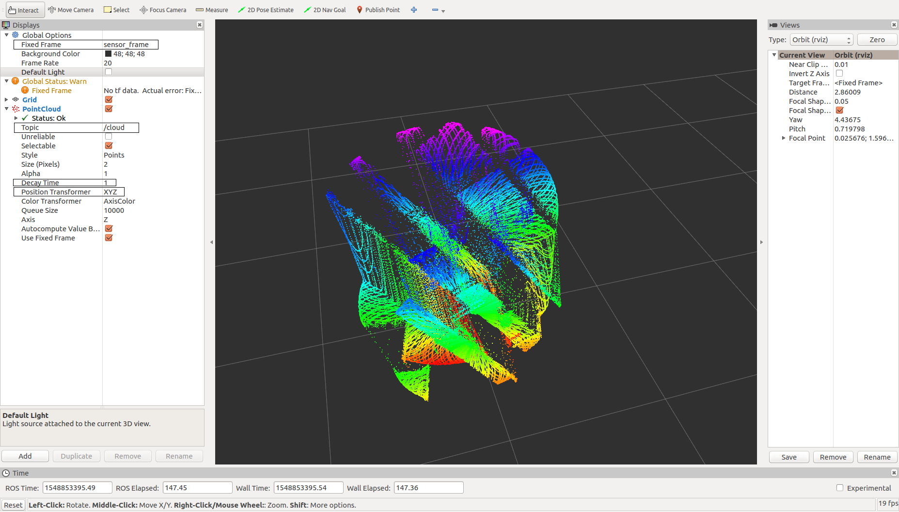

# Official Q&A Site

https://groups.google.com/forum/#!forum/livox-lidars

# Livox ROS Demo

Livox ROS demo is an application software running under ROS environment. It supports point cloud display using rviz. The Livox ROS demo includes two software packages, which are applicable when the host is connected to LiDAR sensors directly or when a Livox Hub is in use, respectively. This Livox ROS demo supports Ubuntu 14.04 (ROS Indigo)/Ubuntu 16.04 (ROS Kinetic), both x86 and ARM. It has been tested on Intel i7 and Nvidia TX2. 

## Livox ROS Demo User Guide

The Livox-SDK-ROS directory is organized in the form of ROS workspace, and is fully compatible with ROS workspace. A subfolder named ***src*** can be found under the Livox-SDK-ROS directory. Inside the ***src*** directory, there are two ROS software packages: display_lidar_points and display_hub_points.

### Compile & Install Livox SDK 

1. Download or clone the [Livox-SDK/Livox-SDK](https://github.com/Livox-SDK/Livox-SDK/) repository on GitHub. 

2. Compile and install the Livox SDK under the ***build*** directory following `README.md` of Livox-SDK/Livox-SDK

### Run ROS Demo and Display PointCloud by rviz 

1. Download or clone the code from the Livox-SDK/Livox-SDK-ROS repository on GitHub. 

2. Please replace the broadcast code lists in the `main.cpp` for both display_lidar_points package({Livox-SDK-ROS}/src/display_lidar_points/main.cpp) and display_hub_points package({Livox-SDK-ROS}/src/display_hub_points/main.cpp) with the broadcast codes of your devices before building. The corresponding code section in `main.cpp` is as follows:

   ```
   #define BROADCAST_CODE_LIST_SIZE 3
   char *broadcast_code_list[BROADCAST_CODE_LIST_SIZE] = {
       "00000000000002",
       "00000000000003",
       "00000000000004"
   };
   ```

   The broadcast code consists of its serial number and an additional number (1,2, or 3). The serial number can be found on the body of the LiDAR unit (below the QR code). The detailed format is shown as below:

   

3. Compile the ROS code package under the Livox-SDK-ROS directory by typing the following command in terminal:
    ```
     catkin_make
    ```

4. Source setup.bash file:
    ```
     source ./devel/setup.bash
    ```

5. Run the compiled ROS nodes:
    ```
     rosrun display_lidar_points display_lidar_points_node
    ```
     or
     ```
     rosrun display_hub_points display_hub_points_node
     ```

6. Open a new terminal, and run roscore under the Livox-SDK-ROS directory:
    ```
     roscore
    ```

7. Open another new terminal, and run rviz under the Livox-SDK-ROS directory:
    ```     
    rosrun rviz rviz
    ```

8. Set ROS rviz:

    * Create new visualization by display type, and select PointCloud;

    * Set the Fixed Frame to “sensor_frame” in Global Options and set Frame Rate to 20;

    * Select “/cloud” in Topic under the newly created PointCLoud.

    * rviz settings demo:

      
